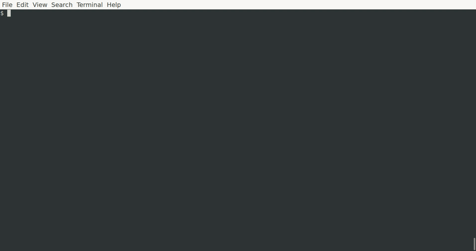

# rucksack: A place to store your useful one liners

## Overview

Rucksack is an interactive command runner that provides useful auto-completion capabilities for those hard to remember one-liners that we all have. It provides a way for you to run your one-liners againt remote systems, complete with any needed arguments (templated out via Jinja2), without having to remember them.

It was inspired by that `useful_stuff.txt` file that every SysAdmin has on their desktop. You know the one: you come up with a clever one-liner, and you throw it in there so that you can reuse it someday.

Rucksack allows you to store your one-liners (and their potential arguments) in a [YAML file](./rucksack.yml). You can then connect to a remote host (or localhost) and run those one-liners from one easy place. No more copying and pasting from a `useful_stuff.txt` file!



**Warning:** Rucksack is a very new project and is under heavy development. Please file an issue if you come across a bug.

## Installing

Rucksack is available on PyPi and can be installed via `pip`:

```
pip install --user rucksack
```

The installation will add the `ruck` command to your path.

## Usage

Rucksack has a help page. Simply run `ruck -h` to see all options.

In general, you simply need to specify `--host ${hostname}` so that Rucksack can connect to a remote host. If you specify `localhost` or `127.0.0.1`, Rucksack will not attempt to connect via SSH and will simply shell out local commands.

Once you launch `rucksack`, you will be taken to a prompt. From there, you can run any commands you have defined in your configuration. To quit, simply enter the `quit` command.

## Configuring

Rucksack uses a simple YAML configuration file (or multiple YAML files) for its configuration. The easiest way to become acquainted with the configuration file is to try out the [tutorial](./doc/tutorial.md).

### Config File Location

Rucksack is configured via one or more YAML files. You can specify a configuration file or directory at the command line, or you can let Rucksack search for one in the following order
* A `rucksack.yml` or `rucksack.yaml`
* Any `.yml` or `.yaml` files in your home directory at `~/.config/` (e.g., `/home/tony/.config/rucksack/config.yml`)
* Any `.yml` or `.yaml` files in `/etc/rucksack/` (e.g., `/etc/rucksack/config.yml`)
* An `/etc/rucksack.yml` or `/etc/rucksack.yaml` file

Rucksack will process the above list **in order** and will stop once it has loaded one or more config files from those locations.

### Config File Syntax

The best way to get up and running with `rucksack` configuration is to follow the [tutorial](doc/tutorial.md). If you're interested in the logistics of a `rucksack` config, then feel free to read on. However, reading the tutorial is **strongly encouraged**, as it will take you through concrete examples.

The basic unit of configuration in `rucksack` is a YAML dictionary with a `command` key:

```yaml
get-uptime:
  command: uptime
```

These dictionaries can be nested, which aids in creating more sensible auto-completions:

```yaml
system:
  basic-info:
    get-uptime:
      command: uptime
```

A command can have 0 or more `args` (arguments), and those arguments can optionally be mandatory. Arguments are rendered using [Jinja templates](https://jinja.palletsprojects.com/en/3.0.x/).

```yaml
tail-log:
  command: "tail {{ log_file }}"
  args:
    - log_file:
        mandatory: True
```

An argument can specify values to the user, and can even have a default value:

```yaml
tail-log:
  command: "tail {{ log_file }}"
  args:
    - log_file:
        mandatory: True
        default: /var/log/syslog
        values:
          - /var/log/syslog
          - /var/log/kern.log
          - /var/log/auth.log
```

Sometimes, you only want to render an argument if the user specifies a value. For example: you don't want to render a command-line flag if the user didn't provide any value for it. This can be done with an `arg_string` key for the argument. In the example below, the `num_lines` argument only appends `-n {{ num_lines }}` to the command if the user specifies a value for `num_lines`.

```yaml
  tail-log:
    command: "tail {{ log_file }}"
    args:
      - num_lines:
         arg_string: -n {{ num_lines }}
      - log_file:
          mandatory: True
          default: /var/log/syslog
          values:
            - /var/log/syslog
            - /var/log/kern.log
            - /var/log/auth.log
```

Finally, argument values can be dynamically interpolated as the result of other commands. The example below provides a list of `log_file`s for the user to choose from by executing a `find` command in `/var/log/nginx`. Be aware that command output is cached, so this might not be appropriate for values that change often.

```yaml
nginx:
  get-top-5-ips:
    command: "sudo cat {{ log_file }} 2>/dev/null | cut -f 1 -d ' ' | sort | uniq -c | sort -hr | head -n 5"
    args:
      - log_file:
          mandatory: True
          from_command: "sudo find /var/log/nginx -name '*access.log*' | grep -v '.gz'"
```

# Credits

Rucksack stands on the shoulders of some giant projects that made it easy to construct. Special thanks to the following projects for such great Python tools. If you enjoy Rucksack, please consider supporting these projects.

* [Python Prompt Toolkit](https://github.com/prompt-toolkit/python-prompt-toolkit)
* [Fabric](https://www.fabfile.org/)
