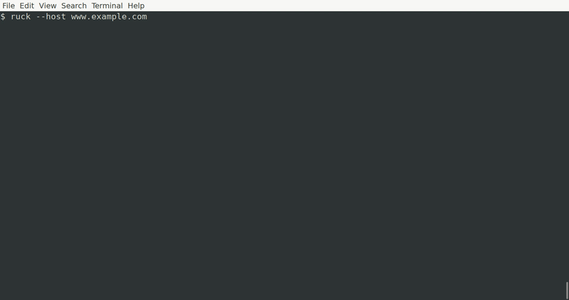
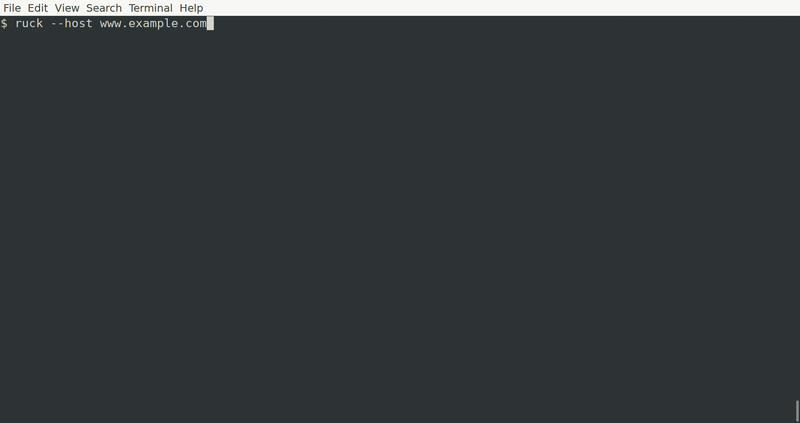

# Rucksack Tutorial

This tutorial is designed to get you up and running with `rucksack`. It assumes that you've already got `rucksack` installed. If it's not installed yet, head over to the [README](../README.md) and install it before proceeding.

By the end of this tutorial, you will understand how to write a `rucksack` config file.

You will need access to a Linux host (either remote over SSH, or localhost).

## A basic command

Rucksack uses nested YAML dictionaries in its config file. These are then used to create auto-completions. The easiest way to understand the syntax is by example, so let's start simple.

Imagine that you always run `uptime && echo && free -h && echo && df -h` as a quick one-liner when logging into a system to troubleshoot. Typing that out (or even remembering it) sounds tedious, so let's put that into a file in your local directory called `rucksack.yml`:

```yaml
system:
  performance:
    get-basic-info:
      command: "uptime && echo && free -h && echo && df -h"
```

Once you've got a `rucksack.yml`, fire up Rucksack: `ruck --host ${host or IP address}`

Rucksack will connect to the remote host over SSH (unless you specify `localhost` or `127.0.0.1`) and you can start using it to execute your basic command:s


## Adding arguments

That was a simple one-liner, so let's get more advanced. Imagine that you have another useful one-liner to find the 10 largest files in a directory, but you want the ability to specify the directory as an argument. Easy! Rucksack renders out commands using [Jinja templates](https://jinja.palletsprojects.com/en/3.0.x/).

Add the following to your `rucksack.yml` and give it a shot:

```yaml
storage:
  find-largest-files:
    command: du -h -d 1 {{ directory }} | sort -hr | head -n 10
    args:
      - directory:
          mandatory: True
```


That's cool, but what if you wanted to have your most common directories as suggested arguments, and just default to `/var/log` if no argument is provided?

Let's update the `storage find-largest-files` command to provide some options to the user:

```yaml
storage:
  find-largest-files:
    command: du -h -d 1 {{ directory }} | sort -hr | head -n 10
    args:
      - directory:
          mandatory: True
          default: /var/log
          values:
            - /etc
            - /home
            - /var/log
```



This is starting to look more useful, but there's still that hardcoded value of `10` for `head -n 10`. What if we wanted `head` to only append `-n` if we provided a value? And while we're at it, let's make the `du` depth an argument:

```yaml
storage:
  find-largest-files:
    command: du -h -d {{ depth }} {{ directory }} | sort -hr | head
    args:
      - directory:
          mandatory: True
          default: /var/log
          values:
            - /etc
            - /home
            - /var/log
      - depth:
          mandatory: True
          default: 1
      - num_files:
          arg_string: -n {{ num_files }}
```

When an argument has an `arg_string`, it is only rendered and appended to the command when the argument is specified. Because the `arg_string` is appended to the `command`, this only works if you are adding an argument to the final command in a long one-liner. For example: this wouldn't work for the `sort` command in our example.



## Dynamic Arguments

Static argument values, like the ones we've seen so far, are great. But what if the value of your argument is actually the output of another command?

For example: running the `smartctl` command to check disk health is useful, but how do you know the names of the disks on your system? Every system is different, and you can't rely on a static list of potential argument values.

Imagine that you run `lsblk -d -o NAME | tail -n +2 | grep -v loop` to find block devices on your system. You can have `rucksack` present the output of a command, such as this one, as potential argument values. Let's add a new section and command to `rucksack.yml`:

```yaml
disk:
  get-health:
    command: sudo smartctl -a /dev/{{ disk }}
    args:
      - disk:
          mandatory: True
          from_command: lsblk -d -o NAME | tail -n +2 | grep -v loop
```


Be aware that command output is cached, so this approach might not be appropriate for values that change often.

## Wrapping up

If you've made it this far, you have a good idea of how to write a `rucksack` config file. Congratulations! Next time you come across a useful one-liner, throw it into a `rucksack` config and save your brain the trouble of memorizing it.

This is pretty much all there is to `rucksack`. Feel free to review the [README](../README.md) for additional info, such as where to put your config files, or how to enable logging. And of course, feel free to open an issue (or a PR) if you find any problems.
